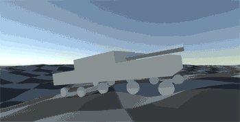
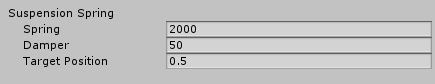
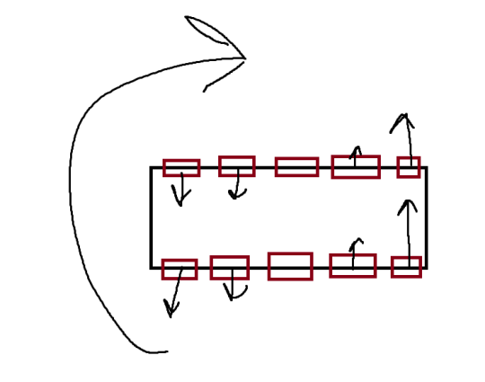

# Physics Tank Example
This project is meant to show three different ways to use Unity's standard WheelCollider to create a driveable tank. The code is commented, and there are tooltips on all the parameters for the TankPhysics component. 

Something to keep in mind is that this is very much just an example. While you could theoretically just plug this into a project and set it up, because it’s so general purpose and prototype-like I would recommend deciding on which method you like best, and then simplifying the code to take only what you need.

Built in **Unity 2017.3**.

## Download

You can either clone the repository or [download the asset package](./PhysicsTankExample.unitypackage) located in the root.

## The WheelCollider

WheelColliders are the secret to this. In my experience, as long as the suspension forces are in line with the mass value, the suspension is well behaved. In the case of this project, the tanks have a mass of 100 Unities, and then each wheel has a spring force of only 2000, with a very small damper value of 50.

## The Tank

The tank is controlled with WASD, but with three very different implementations. All three tanks are in the TankDriving scene included in the package. Simply enable/disable whichever tank you want to drive.

#### Wheel Collider lists

There are 5 lists of WheelColliders in the PhysicsTanks script. Feel free to put any WheelColliders in any of the lists that are relevant to that wheel. Wheels can be in multiple lists if they need to do multiple things. For example, a wheel that is both powered and steers would be in both the Front (or Rear) list, **and** the Powered Wheels list.

#### Center of Mass

To aid in stability, and prevent the tank from flipping over during turns, you can override where the center of mass of the tank is. To use this, create a child GameObject of the tank, position it where you want the center of mass, and then assign that GameObject to the Center of Mass parameter.

### Four Wheel Steering

This tank steers by turning the frontmost pair of wheels, and rearmost pair. The angle that the wheels turn is set by the Steering Angle parameter. In my opinion, this is the most fun and consistent tank to drive, but it has a big limitation in that it cannot turn in place. With 

### Differential Steering

This tank steers using the real life tank solution of one set of tracks turning more the other, or turning in the opposite direction. The problem with this in practice is that the sideways friction of a WheelCollider will prevent differential steering from working. For example, if you try to rotate clockwise, the wheels will fight that rotation, and they'll fight it harder the further away they are from the pivot point.

To get around this, all the wheels except the two center ones have a sideways stiffness of 0.1, while the center ones have a sideways stiffness of 10. All the sideways traction is coming from the center wheels, but all the wheels can still apply forwards/reverse motion because their forward friction is untouched. This *mostly* works, but you can get into weird situations where one or both of your two center wheels are off the ground, and so the tank slips around in an unintuitive way. Just moving across rough terrain in general can cause some weird uncommanded turns that don’t quite seem right.

### Magic Steering

This one allows for both turning while standing still, and turning in a very controlled and predictable manner. Basically, the tank rotates with magic. You supply a Magic Turn Rate (45 degrees by default), and it just rotates the tank by rotating the rigidbody itself. Using rigid.MoveRotation, you still get the physics of suspension bobbing the tank around, while still being able to apply a turn with magic code.

# Changelog

### 1.0 (Feb 18 2018)

- Released